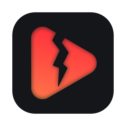
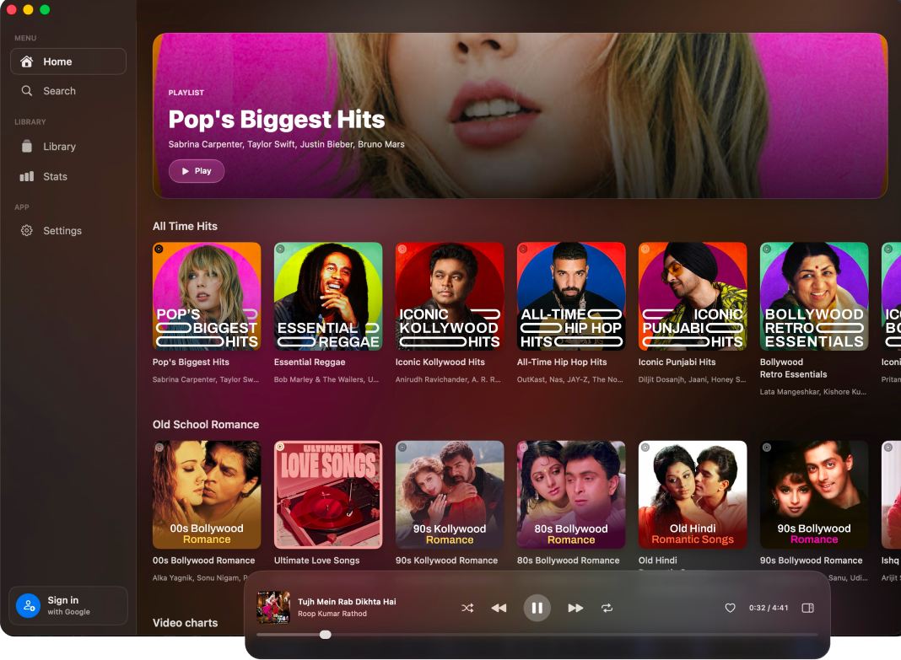
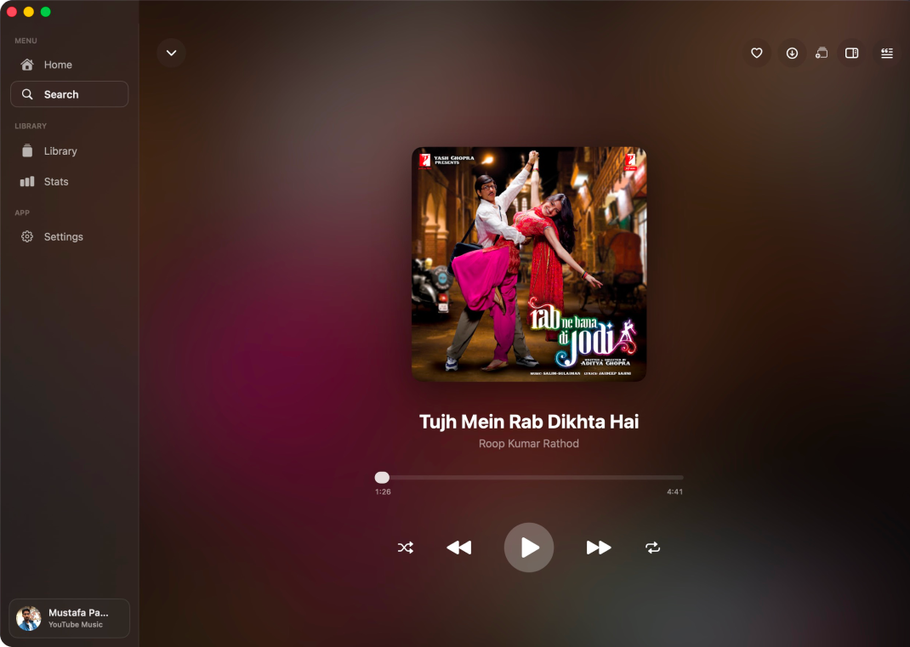
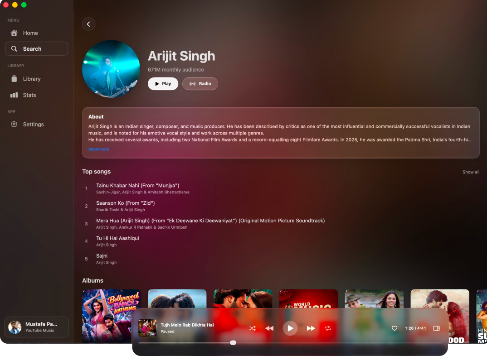
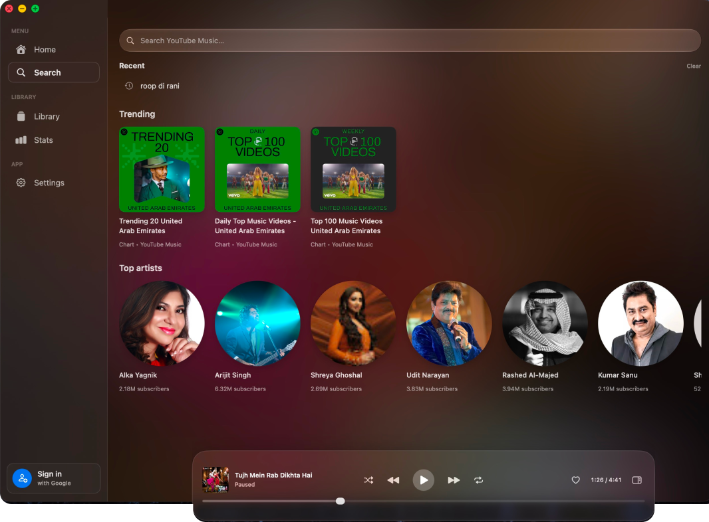
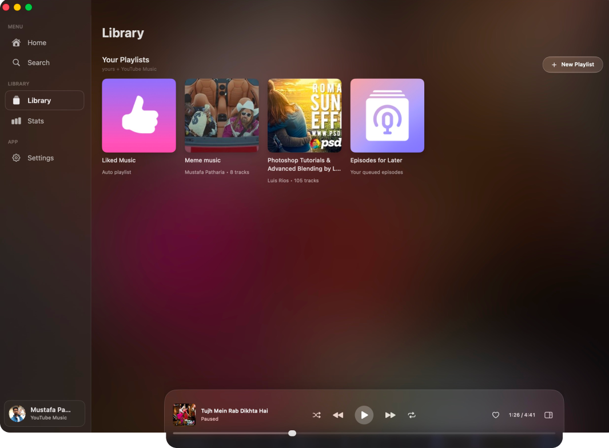

<div align="center">



# Rift Music App

<!-- brand-crimson badges -->


### A native Mac **YouTube Music** client — a Dynamic Island, private by default.

**[⬇ Download](../../releases/latest)** · **[📓 Changelog](CHANGELOG.md)** · **[🌐 Website](website/)** · **[⚖ License](LICENSE)**

</div>

---

## The idea

**Rift Music App is a pure player.** Sign in with your Google account and your whole YouTube
Music world — playlists, likes, recommendations, two-way sync — flows into a native
SwiftUI app with a Dynamic Island in your notch.
No account required for anonymous mode.

One library. One queue. One beautiful player. And **more interesting things to come.**

---

## 📸 See it

<table>
  <tr>
    <td width="50%" align="center"><b>Home</b><br><sub>Featured playlists · recently played · top artists</sub><br><br></td>
    <td width="50%" align="center"><b>Now Playing</b><br><sub>Full-window art · live scrubber · transport</sub><br><br></td>
  </tr>
  <tr>
    <td width="50%" align="center"><b>Lyrics</b><br><sub>Synced · on-device transliteration & translation</sub><br><br></td>
    <td width="50%" align="center"><b>Artist</b><br><sub>Bio · monthly listeners · top songs · radio</sub><br><br></td>
  </tr>
  <tr>
    <td width="50%" align="center"><b>Search</b><br><sub>Trending charts · recents · top artists</sub><br><br></td>
    <td width="50%" align="center"><b>Library</b><br><sub>Your playlists · likes · downloads</sub><br><br></td>
  </tr>
</table>

<div align="center"><sub>The Dynamic Island, expanded — album art, scrubber and transport in the notch.</sub><br><br></div>

---

## ✨ What Rift Music App does


<br>

| | |
|---|---|
| 🎧 **Full catalog, native UI** | Search, albums, artists, playlists, moods and charts — all SwiftUI. |
| 🌟 **Real recommendations** | Home feed, radio & autoplay, *"More like…"* and *"Because you liked…"* seeded by what you actually play. |
| 🏝 **A living notch** | A Dynamic Island for album art + equalizer; hover to a full transport. |
| ⬇ **Offline, properly** | Download tracks and keep them; streams cache for instant replay. |
| 🎤 **Lyrics + on-device AI** | Synced lyrics; optional local AI (Apple Intelligence / Ollama) transliterates & translates. |
| 📊 **Your listening, charted** | Top songs, top artists, listening clocks — computed and stored **locally only**. |
| 🔒 **Private by default** | No telemetry, no analytics, no cloud middleman. Credentials live in the Keychain. |

---

## 🚀 Get Rift Music App

> **v1.0.0** — the first stable release.
> Requires macOS 14 Sonoma or later. Streaming uses `yt-dlp` under the hood.

**Download** — grab the latest from **[Releases](../../releases/latest)**, drag to Applications, done.

**From source:**

```bash
git clone https://github.com/MustafaPatharia/rift-music-app
open rift-music-app/Rift.xcodeproj   # Xcode 26+ · macOS 14 Sonoma+
```

**The website** (marketing / this repo's `website/`) is a static Next.js app:

```bash
cd website && npm install && npm run dev
```

---

## 🧱 Under the hood


> **The core rule:** nothing above `PlaybackSource` knows where audio comes from.
> That seam is what keeps Rift Music App clean and lets it keep getting better.

*[Interactive diagram →](Docs/architecture.html)* (open in a browser)

---

**[GPL-3.0](LICENSE)** — free as in freedom. Attributions in [NOTICE](NOTICE).

Rift Music App is an independent open-source project — **not affiliated with, endorsed by, or
connected to Google LLC, YouTube, or any music service it connects to.** All
trademarks belong to their owners. No ads, no resale, no bundled credentials;
downloading content may conflict with a service's terms — use responsibly where
permitted.

Protocol & design references: [ytmusicapi](https://github.com/sigma67/ytmusicapi) ·
[OuterTune](https://github.com/OuterTune/OuterTune) ·
[Atoll](https://github.com/Ebullioscopic/Atoll) ·
[pear-desktop](https://github.com/pear-devs/pear-desktop)
